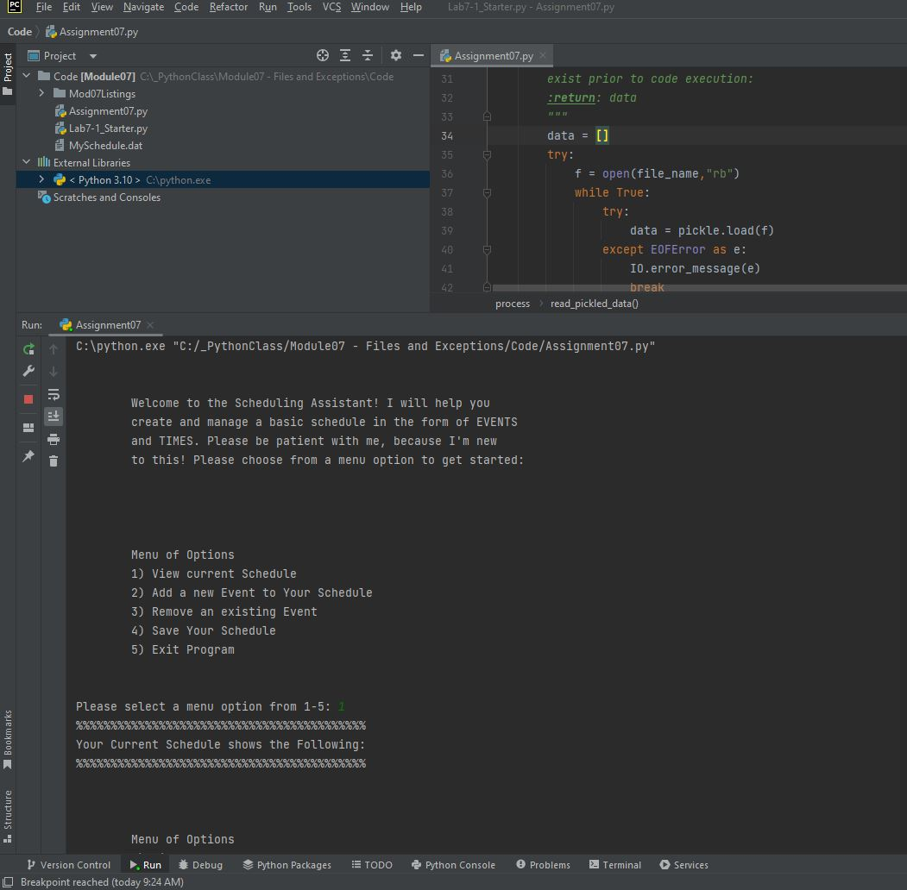

# Assignment 07  
# Pickling Data & Structured Error Handling
**Dev:** *N. Sandhu*  
**Date:** *5/31/2022*

## Introduction
For the seventh assignment for IT FDN 110, students were tasked with demonstrating data pickling and structured error handling by creating a new code of their choice. This document will describe the process I took and code I wrote to successfully accomplish this task. My code was written to assist in scheduling events. It uses a similar structure to the “To Do List” manager of the previous weeks, but has the added wrinkles of using the “datetime” module and enjoys lots of possible error points that can be handled. There is also a benefit to having schedule data pickled as this imposes a pseudo-encryption that ensures the basics of one’s schedule are not openly available unless using the code itself.

## Code Walkthrough
Figure 1 shows the code written to perform the specified function. The first several lines encompass the header of the code, which is self-explanatory and will not be covered in detail in this document. The rest of the code will be explained by section: Data, Processing, and I/O.

### Data
The first section of code encompasses initialization of any variables that will be used later in the code. It also imports other modules of code used in the script. These import statements import the pickling module for use in pickling data. The sys module is imported due to use of the sys.exit() function, which is used for structured error handling of a severe scenario. The datetime module is imported as dt, as datetime objects are used to store date and time information for different events that are input into one’s schedule. Several variables are initialized, almost all blank, except for fileName. This variable holds the default file name for the scheduling data binary file, which is MySchedule.dat. 

### Processing
The second section of code defines the “Processor” class and several functions that perform different tasks in the code. There are four functions in this section.

The first function is read_pickled_data, which reads any existing pickled data from the file file_name, which is MySchedule.dat by default. This function starts by trying to open the binary file in read mode. If the file does not exist, this will throw a FileNotFoundError in Python, which is handled via an except statement. The information for this error is passed to the function in the Input/Output portion of the code called error_message, which then spits out a message to user based on the input argument e. In this instance, if the file MySchedule.dat does not exist, the sys.exist() function is called to immediately end the program and display a message to the user that the binary file is required, even if empty, prior to starting the program. The program cannot run without this file. In a future expansion, it would be simple to add a block of code that asks the user if they would like the system to create a new schedule file and then start, however this was not included in this script for the sake of demonstrative simplicity. If the file exists, its contents are read into the data variable, which is then returned to the main body. Reading a pickled file line-by-line will create an EOFError, or “end of file error,” and thus this is handled by calling the error_message function, which calls the pass statement to essentially ignore this error.

The second and third functions are add_event_to_schedule and remove_event. These functions either add or remove an event in the form of dictionary rows from a supplied list of scheduling data. These functions are very similar to the previous two weeks of creating a to-do list manager and will not be covered in detail in this document. More information on the guts of these functions can be found in the previous documentation.

The final function in this class is the pickle_data function. It takes in arguments of file_name (default: MySchedule.dat) and data (default: empty list) and writes the data in data to a binary file of name file_name in the local code directory. This is programmatically very simple, as pickling data simply involves calling the pickle.dump() function on a valid, open binary file f. This is all these four lines of code do, and then the file f is closed and the function completes with no return values.

### I/O
This section of code defines all of the I/O necessary to achieve the functionality of the code, mostly consisting of print and input statements, though the main error handling function is also housed in this class.

The first function is a simple welcome_message that prints a message to the user when the code is first started up explaining what the code does and prompting the user to choose a menu option. There are no parameters or returns.

The second function is similar in its simplicity. The display_menu function prints the menu to the user for selecting an option between 1 and 5 to perform the various tasks of the program. There are no parameters or returns.

The third function, get_menu_input, returns the user’s choice for the menu in the parameter choice.

The fourth function is the main error handling function in the script, error_message. At most common error-prone points (where the user makes an input), a try-except format is used. If an error is returned from these areas, the error information is stored in the variable e and passed to this function. This function determines what type of error e is and returns a message based on that information. In most cases, the built-in Python error information is not displayed to the user for simplicity, as most mistakes are easily corrected by the user by trying their input again. Because this program is based on file I/O and user input of values (menu options, date and time of events), the most common errors are file errors (EOFError and FileNotFoundError) or ValueErrors, where the user’s input is not within the bounds of useability for the code. There is one custom Exception error in this code, which is raised when the user inputs a menu option that is an integer, but not within the bounds of the menu (i.e., if the entered integer is not between 1 and 5). In this case, a custom error message is displayed, prompting the user to only enter an integer between 1 and 5 for the main menu.

The fifth function in this class displays existing schedule data in the parameter data to the user on-screen. This is achieved by looping through the dictionary rows of data and printing them to the user. Some formatting must be done on the datetime object stored in the Time key for each row of data. This is part of the datetime module and converts the datetime object to a string such that it can be concatenated and displayed to the user in a viewing-friendly format. There are no returned parameters in this function.

The sixth function, get_user_event_time, incorporates the datetime module. The user is prompted for the name of an event and the time of the event they would like to add to their schedule. There are no parameters for this function. The user is asked to supply the time in a specific formatting (MM/DD/YYYY for date and HH:MM for time of day) such that the information can be easily converted to integers and fed into the datetime.datetime function to convert the integers to a datetime object. This format ensures the time is controlled and is not subject to being split or lost in translation, as every event time is treated as a single datetime object instead of a string of separate characters. Each integer entered by the user must be within the range of normal time (1-31 days in a month, 1-12 months in a year, years 1-9999 due to the limitations of the datetime module, 0-23 hours per day in a 24-hour format, and 0-59 minutes in an hour). If a non-integer is entered for any of these parameters, a ValueError is raised and handled per the error_message function. If any of the integers are out of bounds, the program loops and the user must try the time entry again. If successful, the information is converted into a datetime object and both this object and the event are returned to the main body via the parameters event and time.

The seventh and eighth functions are very simple in operation. The get_event_to_remove function returns a string input from the user for the name of an event they’d like to remove from their schedule, while the exit_message function displays a message to the user prior to the program ending.

### Main Body
The main body of the script starts by calling the read_pickled_data function from the process class and storing the returned information in the variable scheduleData. This variable serves as the main vessel for schedule data as it is manipulated through the code. The function is fed the fileName variable, which is assigned to MySchedule.dat in the data portion of the code.

Next, the welcome_message function is called to present a welcome message to the user. The process of displaying this message and initializing the scheduleData variable only occur once for every code run.

The remainder of the code is wrapped in an infinite loop, such that the user can continually make menu choices as long as they do not explicitly choose to exit the program. If the user enters a non-integer option for their menu input (retrieved via a call to get_menu_input), then a ValueError is raised and handled. If an integer is entered but it is out of range, then a custom error is raised and the user is told to restrict inputs to integers between 1 and 5. In both cases, the menu is displayed again and the user may make another input for menu option.

If a valid menu option is entered, a match-case system is used to handle the different choices. This is formatting that was introduced in Python 3.10 and is similar in operation to the switch-case format in other coding languages. Essentially, the code uses the variable tagged to match and examines which case it is equal to and will execute the code in that case block and that block only. Then, due to the infinite loop, the code will loop back up to the menu and the process will continue. This structure is very similar to the if-elif-else structure but provides a more streamlined option for menu-driven programs and enhances code clarity. This match-case section encompasses the bulk of the code being called based on the user menu choices and is done in under 15 lines.

The details of each case are self-explanatory based on the functions being called in the menu and are not covered in detail in this section of documentation. If the user chooses menu option 5, the code breaks from the infinite loop and ends upon a user input.

Operation of the code in both PyCharm and the Windows Command Console is given in Figs. 2 through 10.

## Summary
In summary, this document describes the code behind a successful demonstration code for data pickling and structured error handling. The demonstration is wrapped in a simple scheduling assistant code. Several common errors in the code are handled such that user-friendly error messages are displayed and the code continues to run rather than breaking and displaying high-level error information. Data is successfully pickled and unpickled from a binary file, as shown in the Figs. 2 through 10. Several other common coding tools are also utilized, such as the import of the sys and datetime modules as well as the use of the match-case structure in the main body of the code as opposed to the if-elif-else structure.

```  
# ---------------------------------------------------------------------------- #
# Title: Assignment 07 - Trying-Its-Best Scheduling Assistant
# Description: Simple bot that will assist in maintaining a schedule, pickled in
#               a file named "MySchedule.dat", via user input;
#               the program utilizes custom error handling
# ChangeLog (Who,When,What):
# NSandhu,5.28.2022,Initialized code
# NSandhu,5.29.2022,Debugging
# ---------------------------------------------------------------------------- #

# %%%%%%%%%%%%%%%%%%%%%%%%%%%%%%%%% DATA %%%%%%%%%%%%%%%%%%%%%%%%%%%%%%%%%%%%%%%%%#
import pickle
import sys
import datetime as dt
fileName = "MySchedule.dat"
scheduleData = []
userChoice = ""
userEvent = ""
userTime = None
userRemove = ""

# %%%%%%%%%%%%%%%%%%%%%%%%%%%%%%% PROCESSING %%%%%%%%%%%%%%%%%%%%%%%%%%%%%%%%%%%%%#
class process:
    """Processes data and information"""

    @staticmethod
    def read_pickled_data(file_name = "MySchedule.dat"):
        """ Reads in existing pickled data, else creates new pickle file

        :param file_name: file where stored schedule data is, default is MySchedule.dat. Note that this file needs to
        exist prior to code execution:
        :return: data
        """
        data = []
        try:
            f = open(file_name,"rb")
            while True:
                try:
                    data = pickle.load(f)
                except EOFError as e:
                    IO.error_message(e)
                    break
        except FileNotFoundError as e:
            IO.error_message(e)
        f.close()
        return data

    @staticmethod
    def add_event_to_schedule(event, time, data):
        """ Adds data to a list of dictionary rows

        :param event: (string) with name of event:
        :param time: (datetime object) with time and date of event:
        :param scheduleDAta: (list) with dictionary rows for event and time data:
        :return: scheduleData (list) of dictionary rows of data
        """
        row = {"Event": event, "Time": time}
        data.append(row)
        print("Event added to your schedule.")
        return data

    @staticmethod
    def remove_event(event, data):
        """ Removes data from a list of dictionary rows

        :param event: (string) with name of event to remove:
        :param data: (list) filled with schedule data:
        :return: (list) of dictionary rows of schedule data
        """
        i = 0
        flag = 0
        for row in data:
            if row["Event"].lower() == event.lower().strip():
                flag = 1
                i += 1
                data.remove(row)
                print("Event removed from your schedule.")
            else:
                i += 1
                if i == len(data) and flag == 0:
                    print("Event not found.")
                    print()  # print new line for looks
        return data

    @staticmethod
    def pickle_data(file_name = "MySchedule.dat", data = []):
        """ Writes data from a list of dictionary rows to a File

        :param file_name: (string) with name of file, default is MySchedule.dat:
        :param data: (list) you want filled with file data, default is blank:
        :return: nothing
        """
        f = open(file_name, "ab")
        pickle.dump(data,f)
        f.close()
        print("Data saved!")
# %%%%%%%%%%%%%%%%%%%%%%%%%%%%%%%%%% I/O %%%%%%%%%%%%%%%%%%%%%%%%%%%%%%%%%%%%%%%%%#

class IO:
    """ Performs I/O tasks """

    @staticmethod
    def welcome_message():
        """  Display a Welcome message to the user

        :return: nothing
        """

        print("""
        Welcome to the Scheduling Assistant! I will help you
        create and manage a basic schedule in the form of EVENTS
        and TIMES. Please choose from a menu option to get started:\n
        """)

    @staticmethod
    def display_menu():
        """  Display a menu of choices to the user

        :return: nothing
        """
        print('''\n
        Menu of Options
        1) View current Schedule
        2) Add a new Event to Your Schedule
        3) Remove an existing Event
        4) Save Your Schedule        
        5) Exit Program
        ''')
        print()  # Add an extra line for looks

    @staticmethod
    def get_menu_input():
        """  Get user input for any item

         :return: input
            """
        choice = input("Please select a menu option from 1-5: ").strip()
        return choice

    @staticmethod
    def error_message(e):
        """  Displays one of several error messages based on exception raised

        :param e: an exception object:
        :return: nothing
        """
        print()
        if isinstance(e,ValueError):
            print("Please only enter integer values or ensure time formatting is correct!\n")
        elif isinstance(e,EOFError):
            pass
        elif isinstance(e,FileNotFoundError):
            sys.exit("Schedule file does not exist, please create a blank 'MySchedule.dat' file in the local directory "
                  "and try again")
        elif isinstance(e,Exception):
            print(e)

    @staticmethod
    def view_schedule(data):
        """ Shows the current EVENTS in the list of dictionaries rows

                :param data: list of data to be displayed:
                :return: nothing
                """
        print("%%%%%%%%%%%%%%%%%%%%%%%%%%%%%%%%%%%%%%%%%%")
        print("Your Current Schedule shows the Following: ")
        for row in data:
            print(row["Event"] + " happening on " + row["Time"].strftime("%m/%d/%Y, %H:%M"))
        print("%%%%%%%%%%%%%%%%%%%%%%%%%%%%%%%%%%%%%%%%%%")
        print()

    @staticmethod
    def get_user_event_time():
        """ Gets user input for event and time to add to schedule

        :return: event (user input of event, string)
                time (user input of date and time as datetime object)
        """
        event = input("Please input Event name: ")
        while True:
            try:
                timeMonth,timeDay,timeYear = input("Please enter date of event in MM/DD/YYYY format: ").split(sep="/")
                timeHour, timeMin = input("Please enter time of Event in HH:MM format (24 HOUR FORMAT): ").split(sep=":")
                timeDay = int(timeDay)
                timeMonth = int(timeMonth)
                timeYear = int(timeYear)
                timeHour = int(timeHour)
                timeMin = int(timeMin)
                if timeDay not in range(1,32) or timeMonth not in range(1,13) or timeYear not in range(1,10000) or timeHour not in range(0,24) or timeMin not in range(0,60):
                    print("One of the entered time parameters is out of range, please try again.")
                    continue
                break
            except ValueError as e:
                IO.error_message(e)
                print("Please try again.")
                print()
        time = dt.datetime(year=timeYear, month=timeMonth, day=timeDay, hour=timeHour, minute=timeMin,second=0)
        return event, time

    @staticmethod
    def get_event_to_remove():
        """  Gets the event name to be removed from the list

        :return: (string) with task
        """
        remove_event = input("Please enter name of Event to remove from list: ").strip()
        return remove_event

    @staticmethod
    def exit_message():
        """  Displays a message to the user prior to exiting program

        :return: nothing
        """
        print("Thank you! Program will end upon hitting 'Enter'...")

# %%%%%%%%%%%%%%%%%%%%%%%%%%%%%%%%% MAIN %%%%%%%%%%%%%%%%%%%%%%%%%%%%%%%%%%%%%%%%%#

scheduleData = process.read_pickled_data(fileName)

IO.welcome_message()

while True:
    IO.display_menu()
    try:
        userChoice = int(IO.get_menu_input())
        if userChoice not in range(1,6):
            raise Exception("Please only input a value from 1 to 5!")
    except ValueError as e:
        IO.error_message(e)
        continue
    except Exception as e:
        IO.error_message(e)
        continue

    match userChoice:
        case 1:
            IO.view_schedule(scheduleData)
        case 2:
            userEvent, userTime = IO.get_user_event_time()
            scheduleData = process.add_event_to_schedule(userEvent, userTime, scheduleData)
        case 3:
            userRemove = IO.get_event_to_remove()
            scheduleData = process.remove_event(userRemove,scheduleData)
        case 4:
            process.pickle_data(fileName, scheduleData)
        case 5:
            IO.exit_message()
            input()
            break
```
#### Fig. 1. Code written by N. Sandhu for creation of the scheduling assistant program


#### Fig. 2. The code running in PyCharm, showing an error and exiting the program if the MySchedule.dat binary file is not found in the local directory.


#### Fig. 3. The code running in PyCharm. Code start and an empty schedule are shown.


#### Fig. 4. The code running in PyCharm. An event is added to the schedule.


#### Fig. 5. The code running in PyCharm. An event is removed from the schedule.


#### Fig. 6. The code running in PyCharm. A demonstration of structured error handling based on invalid user inputs for time.


#### Fig. 7. The code running in PyCharm. Data has been pickled and saved to the MySchedule.dat file, which is displayed in Notepad to show that it is in binary format.


#### Fig. 8. The code running in the Windows Command Console. The results of not having a MySchedule.dat file, fixing this issue, and then showing an empty schedule.


#### Fig. 9. The code running in the Windows Command Console. Events and times are added to the schedule.


#### Fig. 10. The code running in the Windows Command Console. An event is removed, data is pickled and saved, and the resulting binary file is shown.
